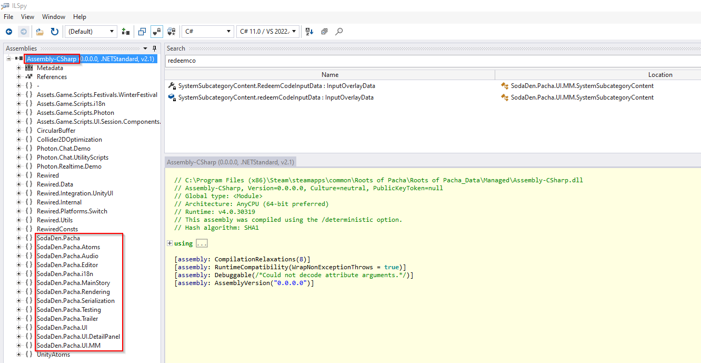
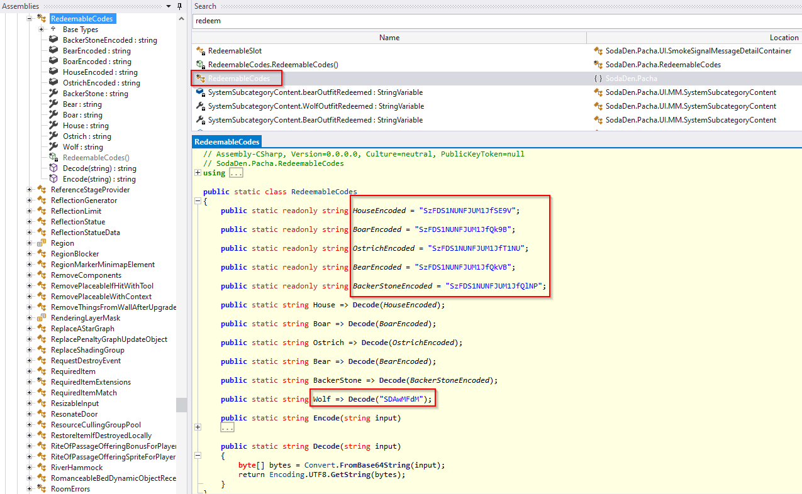
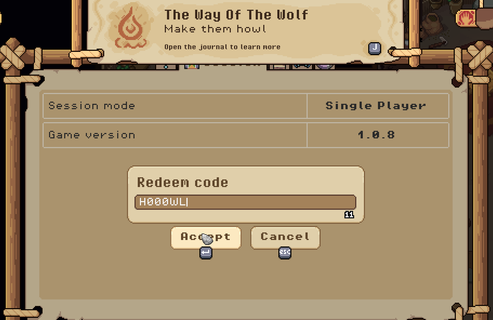
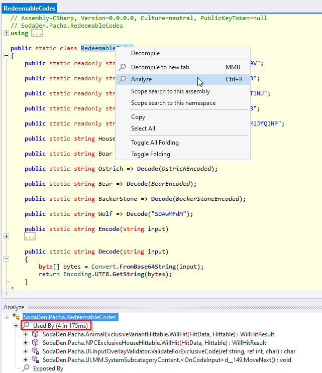

# Reverse Engineering: Roots of Pacha (Kickstarter codes)

## 🦾 Motivation

Over a year ago I purchased two copies of [Roots of Pacha](https://rootsofpacha.com), a prehistoric-themed farm simulation game developed by indie studio [SodaGen](https://sodaden.com), through Kickstarter.

Because I backed the project during its Kickstarter campaign, I received exclusive codes that allowed me to unlock additional game content. However, I only received one of the most basic rewards, commensurate with the amount of money I had contributed to the project. One of the things that caught my attention was that, despite having two different copies of the game, the reward code I received was the same.

> That is, **codes are static depending on the type of reward** you get.

That's why, within my _gamer greed_, I wanted to study a bit the code checking process to know if I was able to unlock all the Kickstarter content. **And in this article I explain you how to do it**.

## 🧰 Tools

The first thing to do is to download the program [ILSpy](https://github.com/icsharpcode/ILSpy), a cross-platform .NET decompiler (which depends on [.NET Desktop Runtime 6.0.16](https://dotnet.microsoft.com/en-us/download/dotnet/6.0), so it is also necessary to have it).
Once the tools are installed, the `Assembly-CSharp.dll` file hosted under the path `%ProgramFiles(x86)%%Steam%steamapps%Roots of Pacha%Roots of Pacha_Data` must be loaded in IlSpy:

## 🎓 Studying the code

### Looking for gold

Once inside, start the process by looking for keywords within the code, such as **key**, **code** and **redeem**. One interesting thing is the static class called `RedeemableCodes`, which contains what appear to be the promotional codes in **base64**:

This is the result after decoding them:

~~~cs
public static readonly string HouseEncoded = "SzFDS1NUNFJUM1JfSE9V"; // K1CKST4RT3R_HOU
public static static readonly string BoarEncoded = "SzFDS1NUNFJUM1JfQk9B"; // K1CKSTST4RT3R_BOA
public static readonly string OstrichEncoded = "SzFDS1NUNFJUM1JfT1NU"; // K1CKSTST4RT3R_OST
public static readonly string BearEncoded = "SzFDS1NUNFJUM1JfQkVB"; // K1CKSTST4RT3R_BEA
public static static readonly string BackerStoneEncoded = "SzFDS1NUNFJUM1JfQlNP"; // K1CKSTST4RT3R_BSO
~~~

Unfortunately, these codes do not correspond to those received by Kickstarter, which are in `XXXX-XXXX-XXXX-XXXX` format, and also do not work when used in-game.

### Hardcoding is my life

Continuing with the investigation, it is possible to observe that there is another code within the `RedeemableCodes` class defined differently from the rest. When decoding its value, it also does not follow the **K1CKST4RT3R_** pattern of the rest of the codes.

~~~cs
public static string Wolf => Decode("SDAwMFdM"); // H000WL
~~~

Unlike the rest of the codes, when trying to enter the `H000WL` code inside the game.... 🎉 THE CODE WORKS 🎉

With this code you get a wolf skin for the game, similar to _[Okka](https://rootsofpacha.fandom.com/wiki/Okka)_.

### A bitter end

To find out how the rest of the codes work, we will analyze _where and when_ the `RedeemableCodes` class is used. Using ILSpy, select the **Analyze** _(Crtl+R)_ option to get the references of where and when these code fragments are used.

An interesting method is `MoveNext` inside `SodaDen.Pacha.UI.MM.SystemSubcategoryContent.<OnCodeInput>d__149`, which consists of the following check:

~~~cs
<error>5__5 = false;
<invalidCode>5__6 = false;
<codeResult>5__7 = null;
if (result == RedeemableCodes.Wolf).
{
	<codeResult>5__7 = "Wolf";
	goto IL_0400;
}
<webRequest>5__8 = UnityWebRequest.Get("https://us-central1-roots-of-pacha-pledgebox.cloudfunctions.net/orders/validate-code?code=" + result.Replace("-", ""));
goto IL_02b0;
~~~

As you can see, codes other than `RedeemableCodes.Wolf` are checked online by making a request to _https://us-central1-roots-of-pacha-pledgebox.cloudfunctions.net/orders/validate-code?code=_.
By making a request to that API, it is possible to observe that the response for invalid codes is `400 Bad Request`:

~~~http
GET /orders/orders/validate-code?code=11111111111111111111 HTTP/2
Host: us-central1-roots-of-pacha-pledgebox.cloudfunctions.net
User-Agent: Roots of Pacha/RE
Accept: */*
~~~

~~~http
HTTP/2 400 
x-powered-by: Express
vary: Origin
content-type: text/plain; charset=utf-8
etag: W/"b-EFiDB1U+dmqzx9Mo2UjcZ1SJPO8"
function-execution-id: dzp46qom6e3i
x-cloud-trace-context: 00dcb74056fb9e32b8b25a6811903c73;o=1
date: Thu, 04 May 2023 14:33:31 GMT
server: Google Frontend
content-length: 11
alt-svc: h3=":443"; ma=2592000,h3-29=":443"; ma=2592000

Bad Request
~~~

Valid codes, on the other hand, return an identifier that is checked inside the `MoveNext` method mentioned above:

~~~http
GET /orders/orders/validate-code?code=<REDACTED> HTTP/2
Host: us-central1-roots-of-pacha-pledgebox.cloudfunctions.net
User-Agent: Roots of Pacha/RE
Accept: */*
~~~

~~~http
HTTP/2 200 
x-powered-by: Express
vary: Origin
content-type: text/html; charset=utf-8
etag: W/"c-axJCePMEBUBMGYDipb7BeNjTSIg"
function-execution-id: xjaf1wrdjzs0
x-cloud-trace-context: 3a0ad57b00afc686ac7535a264c7cc4b;o=1
date: Thu, 04 May 2023 14:38:46 GMT
server: Google Frontend
content-length: 12
alt-svc: h3=":443"; ma=2592000,h3-29=":443"; ma=2592000

Backer_Stone
~~~

Unfortunately again, this is where the investigation ends, as each code consists of 12 alphanumeric characters (**4,738,381,338,321,616,896 possible combinations**) and only five of them are valid.

> Performing brute force techniques or any other attack vector against the web server would not only be complicated, but it is also completely illegal because we have no authorization to do so.

## 📓 Conclusion

Having found **a new code** was not bad at all, despite not being eligible for all the Kickstarter rewards.
It is noted that the code `ReedemableCodes.Wolf` has been coded in a hurry as it was not checked through the API, like the rest of the codes. The truth is that it has been a real luck.

Even so, it is possible that in the future I will be encouraged to continue with this research. Not only do I want to be able to get all the rewards, but I have also found online hints of [other promotions](https://rootsofpacha.com/festival/) (linked to the game demo) but which are currently not compatible with the current version.

